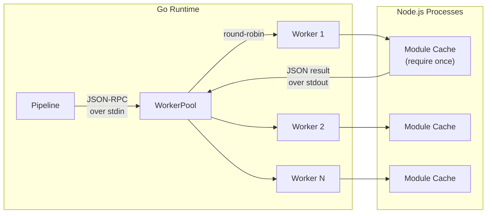
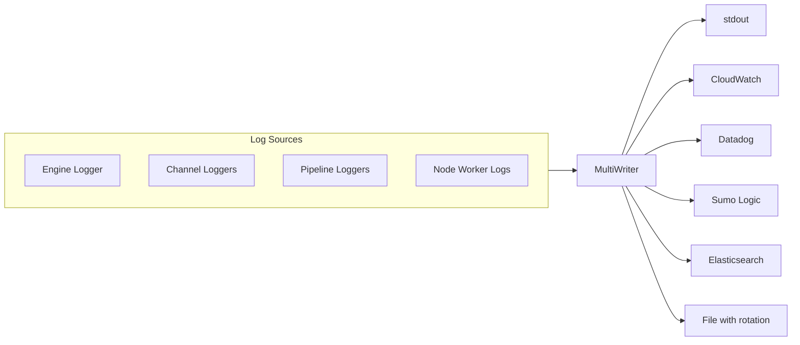
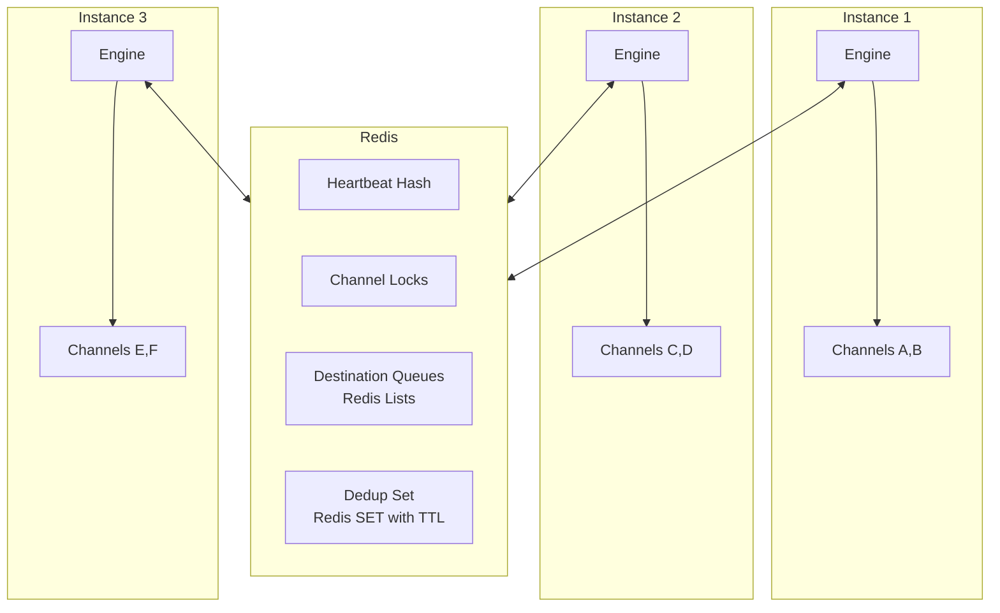

# Intu Roadmap

Six phases, each independently implementable by a cloud agent against the current codebase. No placeholders, no stubs -- every phase produces fully working, testable functionality.

---

## Phase 1: Node.js Worker Pool Runtime (Replace Goja)

**Goal**: Replace the Goja JS runtime with a pool of long-running Node.js worker processes. Workers are cold-loaded at engine start with all channel modules pre-cached in V8. Each `Call()` executes in sub-millisecond time. Console logs forward to Go structured logging. Transformer execution time is measured in ms and included in JSON log output.

### What exists today

- `[internal/runtime/jsrunner.go](internal/runtime/jsrunner.go)`: `JSRunner` interface with `Call(fn, entrypoint, args...) (any, error)` and `Close() error`. `GojaRunner` re-reads and re-parses the JS file on **every call** (no caching). ESM-to-CJS conversion strips `import` lines and rewrites `export function` to `exports.fn`. No `console` object available -- `console.log` throws `ReferenceError`.
- `[internal/runtime/pipeline.go](internal/runtime/pipeline.go)`: `Pipeline.callScript(fn, file, args...)` resolves `.ts` files to `dist/.../*.js` and delegates to `JSRunner.Call()`. No execution timing.
- `[internal/runtime/engine.go](internal/runtime/engine.go)`: `buildChannelRuntime()` creates a new `GojaRunner()` per channel (line 232). Global hooks also create a fresh `GojaRunner` (lines 77, 179).
- `[go.mod](go.mod)`: `github.com/dop251/goja` is the only JS runtime dependency.

### Architecture




### IPC Protocol (stdin/stdout JSON lines)

Each line on stdin/stdout is a complete JSON object. Message types:

**Go to Node (stdin)**:

- `{"id":1,"type":"load","module":"/abs/path/to/dist/channels/foo/transformer.js"}` -- pre-load a module
- `{"id":2,"type":"call","module":"/abs/path","fn":"transform","args":[{...msg},{...ctx}]}` -- call a function

**Node to Go (stdout)**:

- `{"id":1,"type":"loaded"}` -- module loaded successfully
- `{"id":2,"type":"result","value":{...}}` -- function return value
- `{"id":2,"type":"error","message":"...","stack":"..."}` -- function threw
- `{"id":0,"type":"log","level":"info","args":["hello",42]}` -- console.log forwarding (id=0 means no request)

### Files to create

1. `**internal/runtime/noderunner.go`** -- `NodeRunner` implementing `JSRunner`
  - `NewNodeRunner(poolSize int, logger *slog.Logger) (*NodeRunner, error)` -- starts N `node` child processes running `worker.js`
  - Each worker: `exec.Command("node", workerJSPath)` with stdin/stdout pipes
  - `PreloadModule(module string) error` -- sends `load` command to all workers, waits for `loaded` response
  - `Call(fn, entrypoint string, args ...any) (any, error)` -- acquires a worker (round-robin with mutex), sends `call`, reads `result`/`error`, forwards any `log` messages to Go `slog`
  - `Close() error` -- sends EOF to all workers, waits for exit
  - Worker selection: round-robin index with sync.Mutex; if a worker is busy, wait (channel-based semaphore per worker)
  - Log forwarding: when reading stdout, if `type=="log"`, call `logger.Info/Warn/Error/Debug` with `"source":"js"` attribute and channel context
  - Default pool size: `runtime.NumCPU()` or the number of enabled channels, whichever is smaller
2. `**internal/runtime/worker.js`** -- embedded Node.js worker script
  - Read JSON lines from `process.stdin` using `readline`
  - Module cache: `const modules = new Map()`
  - On `load`: `modules.set(msg.module, require(msg.module))`, respond `{"id":N,"type":"loaded"}`
  - On `call`: `const mod = modules.get(msg.module)`, call `mod[msg.fn](...msg.args)`, handle async (await if Promise), respond `{"id":N,"type":"result","value":result}`
  - Override `console.log/warn/error/debug` to write `{"id":0,"type":"log","level":"info|warn|error|debug","args":[...]}` to stdout
  - Error handling: try/catch around every call, respond `{"id":N,"type":"error","message":err.message,"stack":err.stack}`
  - The file should be embedded into the Go binary using `//go:embed worker.js` so it works with the distributed binary. At runtime, write it to a temp file and run from there.

### Files to modify

1. `**[internal/runtime/jsrunner.go](internal/runtime/jsrunner.go)`** -- Keep the `JSRunner` interface. Keep `GojaRunner` as a fallback. No changes to the interface.
2. `**[internal/runtime/engine.go](internal/runtime/engine.go)`**:
  - In `Start()`: create a shared `NodeRunner` pool instead of per-channel `GojaRunner`
  - In `buildChannelRuntime()` (line 232): pass the shared `NodeRunner` instead of `NewGojaRunner()`
  - After all channels are built, call `PreloadModule()` for every script file referenced by every channel (transformer, validator, filters, preprocessor, postprocessor, response transformers)
  - In `Stop()`: call `runner.Close()` to shut down workers
  - Global hooks (lines 77, 179): use the shared `NodeRunner` instead of creating a new `GojaRunner`
3. `**[internal/runtime/pipeline.go](internal/runtime/pipeline.go)`**:
  - In `callScript()` (line 321): wrap the call with timing:

```go
     start := time.Now()
     result, err := p.runner.Call(fn, entrypoint, args...)
     elapsed := time.Since(start)
     p.logger.Info("script executed",
         "channel", p.channelID,
         "function", fn,
         "file", file,
         "duration_ms", float64(elapsed.Microseconds())/1000.0,
     )
     

```

- This gives sub-millisecond precision (microseconds / 1000 as float).

1. `**[go.mod](go.mod)**`: Remove `github.com/dop251/goja` dependency (and its indirect deps: `dlclark/regexp2`, `go-sourcemap/sourcemap`, `google/pprof`) after confirming no other code references it. Keep Goja if you want the fallback.

### Config schema (optional enhancement)

Add to `RuntimeConfig` in `[pkg/config/types.go](pkg/config/types.go)`:

```go
type RuntimeConfig struct {
    // ... existing fields ...
    JSRuntime  string `mapstructure:"js_runtime"`  // "node" (default) | "goja"
    WorkerPool int    `mapstructure:"worker_pool"`  // default: 0 (auto = min(NumCPU, numChannels))
}
```

### Testing approach

- Unit test: start `NodeRunner`, load a test JS module, call `transform` with a sample message, verify result
- Benchmark test: call `transform` 10,000 times in a loop, assert average < 1ms
- Console.log test: JS function calls `console.log("test")`, verify Go logger received it
- Error test: JS function throws, verify Go receives error with stack trace
- E2E: run existing `internal/runtime/e2e_test.go` with `NodeRunner` instead of `GojaRunner`

### Dependencies

- Go: `os/exec`, `encoding/json`, `bufio`, `embed` (all stdlib)
- Node.js: no npm packages needed (uses only `readline`, `require`, `process` builtins)

---

## Phase 2: Persistent Message Storage

**Goal**: Implement Postgres and S3 message store backends. Add profile-level default and channel-level override for storage mode: `none` (pass-through, no storage), `status` (store status/metadata only, no message content), `full` (store content at configurable stages). Works with `intu serve` locally (memory or SQLite fallback) and in production (Postgres/S3).

### What exists today

- `[internal/storage/message_store.go](internal/storage/message_store.go)`: `MessageStore` interface (`Save`, `Get`, `Query`, `Delete`, `Prune`). `MemoryStore` is fully implemented. `postgres` and `s3` cases return `"not yet implemented"` errors.
- `[internal/runtime/channel.go](internal/runtime/channel.go)`: `storeMessage()` and `storeMessageWithContent()` always store content (lines 288-324). Called at stages: `received`, `transformed`, `filtered`, `error`, `sent`.
- `[pkg/config/types.go](pkg/config/types.go)`: `MessageStorageConfig` has `Driver`, `Postgres` (`DSN`, `TablePrefix`), `S3` (`Bucket`, `Region`), `Retention` structs -- all already defined.
- Channel config (`pkg/config/channel.go`): has `MessageStorage` field but only `Enabled` and `ContentTypes` fields (no `mode`).

### Files to create

1. `**internal/storage/postgres_store.go`** -- Full Postgres implementation
  - Uses `database/sql` with `github.com/jackc/pgx/v5/stdlib` driver
  - Auto-creates table on init: `CREATE TABLE IF NOT EXISTS {prefix}messages (id TEXT, correlation_id TEXT, channel_id TEXT, stage TEXT, content BYTEA, status TEXT, timestamp TIMESTAMPTZ, metadata JSONB, PRIMARY KEY (id, stage))`
  - Indexes: `(channel_id, status)`, `(channel_id, timestamp)`, `(timestamp)` for prune
  - `Save()`: `INSERT ... ON CONFLICT (id, stage) DO UPDATE`
  - `Get()`: `SELECT ... WHERE id = $1 ORDER BY timestamp LIMIT 1`
  - `Query()`: build dynamic WHERE clause from `QueryOpts`
  - `Delete()`: `DELETE FROM ... WHERE id = $1`
  - `Prune()`: `DELETE FROM ... WHERE timestamp < $1 AND (channel_id = $2 OR $2 = '')`
  - Connection pool: use `sql.DB` with `SetMaxOpenConns`, `SetMaxIdleConns` from config
  - Context support: all methods accept `context.Context` (update interface if needed)
2. `**internal/storage/s3_store.go`** -- S3 implementation for content storage
  - Uses `github.com/aws/aws-sdk-go-v2` with S3 client
  - S3 key format: `{prefix}/{channel_id}/{stage}/{id}.json`
  - `Save()`: `PutObject` with JSON-encoded `MessageRecord`
  - `Get()`: `GetObject` + JSON decode
  - `Query()`: `ListObjectsV2` with prefix filter + metadata filtering
  - `Delete()`: `DeleteObject` (all stages for that ID)
  - `Prune()`: List + batch delete by timestamp comparison from object metadata
  - Support `AWS_ACCESS_KEY_ID`, `AWS_SECRET_ACCESS_KEY`, `AWS_REGION` env vars and IAM roles
3. `**internal/storage/composite_store.go`** -- Composite store for `status` mode
  - Wraps another `MessageStore`
  - In `status` mode: calls inner store's `Save()` but sets `Content: nil` (stores metadata/status only)
  - In `full` mode with stage filtering: only calls `Save()` for configured stages
  - In `none` mode: all operations are no-ops

### Files to modify

1. `**[internal/storage/message_store.go](internal/storage/message_store.go)`**:
  - Update `NewMessageStore()` to instantiate `PostgresStore` or `S3Store` based on driver
  - Add `NewCompositeStore(inner MessageStore, mode string, stages []string) MessageStore`
2. `**[pkg/config/types.go](pkg/config/types.go)`** -- Add to `MessageStorageConfig`:

```go
   type MessageStorageConfig struct {
       // ... existing fields ...
       Mode   string   `mapstructure:"mode"`    // "none" | "status" | "full" (default: "full")
       Stages []string `mapstructure:"stages"`  // when mode=full: ["received","transformed","sent","error"]
   }
   

```

1. **Channel config in `[pkg/config/channel.go](pkg/config/channel.go)`** -- Add channel-level override:

```go
   type ChannelMessageStorage struct {
       Mode          string   `mapstructure:"mode"`           // "none" | "status" | "full"
       Stages        []string `mapstructure:"stages"`
       RetentionDays int      `mapstructure:"retention_days"`
   }
   

```

1. `**[internal/runtime/channel.go](internal/runtime/channel.go)**`:
  - `storeMessage()` / `storeMessageWithContent()`: check channel storage mode before saving
  - If mode is `none`: skip all storage
  - If mode is `status`: save record with `Content: nil`
  - If mode is `full`: check if current stage is in the configured stages list
2. `**[internal/runtime/engine.go](internal/runtime/engine.go)**`:
  - In `buildChannelRuntime()`: create a per-channel `CompositeStore` wrapping the global store, configured with that channel's storage settings
3. `**[cmd/serve.go](cmd/serve.go)**`:
  - Update store initialization to pass full config including mode/stages

### Example config

**intu.yaml** (profile-level default):

```yaml
message_storage:
  driver: postgres         # memory | postgres | s3
  mode: full               # none | status | full
  stages: [received, transformed, sent, error]
  postgres:
    dsn: ${INTU_STORE_DSN}
    table_prefix: intu_
  retention:
    days: 30
```

**intu.dev.yaml** (local dev -- no external deps):

```yaml
message_storage:
  driver: memory
  mode: status
```

**channel.yaml** (per-channel override):

```yaml
message_storage:
  mode: none               # pass-through channel, no storage
```

```yaml
message_storage:
  mode: full
  stages: [received, transformed, sent, error]
  retention_days: 7
```

### Go dependencies to add

- `github.com/jackc/pgx/v5` (Postgres driver)
- `github.com/aws/aws-sdk-go-v2` + `github.com/aws/aws-sdk-go-v2/service/s3` (S3 client)

### Testing

- Postgres: use `pgx` with a real Postgres (testcontainers or docker-compose). Test Save/Get/Query/Delete/Prune.
- S3: use LocalStack or mock S3 endpoint. Test Save/Get/Query/Delete/Prune.
- CompositeStore: unit test with mock inner store, verify `none` skips, `status` strips content, `full` with stages filters correctly.
- Integration: run `intu serve` with `driver: postgres`, send an HTTP message, verify record appears in Postgres with correct stages and content.

---

## Phase 3: Log Transport Support

**Goal**: Add configurable log transport at the profile level. Companies using CloudWatch, Datadog, Sumo Logic, Elasticsearch, or file-based logging can configure their destination. All structured JSON logs (including per-channel, per-message, and transformer timing from Phase 1) route through the configured transport. Stdout remains the default.

### What exists today

- `[pkg/logging/logger.go](pkg/logging/logger.go)`: Creates `slog.NewJSONHandler(os.Stdout, ...)`. Hardcoded to stdout.
- `[internal/observability/channel_logger.go](internal/observability/channel_logger.go)`: Per-channel logger, also writes to stdout via slog.
- All logging uses Go's `slog` package with JSON handler.

### Architecture




The key insight: since all logging uses `slog`, we just need to create a custom `slog.Handler` that multiplexes to configured backends. Each backend implements `io.Writer` (receives JSON bytes), so the `slog.JSONHandler` writes to a `MultiWriter` that fans out.

### Files to create

1. `**pkg/logging/transport.go**` -- Transport abstraction and multi-writer
  - `type LogTransport interface { Write(p []byte) (n int, err error); Close() error }`
  - `NewMultiTransport(transports ...LogTransport) *MultiTransport` -- writes to all
  - `NewTransportFromConfig(cfg *config.LoggingConfig) (LogTransport, error)` -- factory
2. `**pkg/logging/cloudwatch.go**` -- Amazon CloudWatch Logs transport
  - Uses `github.com/aws/aws-sdk-go-v2/service/cloudwatchlogs`
  - Buffers log lines, flushes on interval (500ms) or buffer size (1MB) via `PutLogEvents`
  - Config: `region`, `log_group`, `log_stream` (auto-creates group/stream if not exist)
  - Supports IAM roles and env var credentials
3. `**pkg/logging/datadog.go**` -- Datadog log transport
  - HTTP-based: POST to `https://http-intake.logs.{site}/api/v2/logs`
  - Buffers and batch-sends on interval (2s) or count (100 logs)
  - Config: `api_key`, `site` (default `datadoghq.com`), `service`, `source` (default `intu`)
  - Adds `ddsource`, `ddtags`, `service` fields
4. `**pkg/logging/sumologic.go**` -- Sumo Logic HTTP collector transport
  - POST JSON lines to the configured HTTP source endpoint
  - Config: `endpoint` (the HTTP Source URL), `source_category`, `source_name`
  - Batches on interval (2s) or count
5. `**pkg/logging/elasticsearch.go**` -- Elasticsearch transport
  - Bulk API: `POST /_bulk` with `index` actions
  - Config: `urls` (list), `index` (with date template e.g. `intu-logs-2026.03`), `username`, `password`
  - Batches on interval or count
6. `**pkg/logging/file_transport.go**` -- File transport with rotation
  - Config: `path`, `max_size_mb`, `max_files`, `compress`
  - Rotation: when file exceeds `max_size_mb`, rename with timestamp, compress old files
  - Keep `max_files` rotated files

### Files to modify

1. `**[pkg/logging/logger.go](pkg/logging/logger.go)**`:
  - Change `New(level string)` to `New(level string, cfg *config.LoggingConfig)` 
  - If no transport config (or `transport: stdout`), use `os.Stdout` as before
  - Otherwise, build transport chain via `NewTransportFromConfig(cfg)`, create `slog.NewJSONHandler(transport, ...)`
2. `**[pkg/config/types.go](pkg/config/types.go)**` -- Add `LoggingConfig`:

```go
   type LoggingConfig struct {
       Transports []LogTransportConfig `mapstructure:"transports"`
   }
   type LogTransportConfig struct {
       Type          string `mapstructure:"type"` // stdout | cloudwatch | datadog | sumologic | elasticsearch | file
       CloudWatch    *CloudWatchLogConfig    `mapstructure:"cloudwatch"`
       Datadog       *DatadogLogConfig       `mapstructure:"datadog"`
       SumoLogic     *SumoLogicLogConfig     `mapstructure:"sumologic"`
       Elasticsearch *ElasticsearchLogConfig `mapstructure:"elasticsearch"`
       File          *FileLogConfig          `mapstructure:"file"`
   }
   

```

1. `**Config` struct in `[pkg/config/types.go](pkg/config/types.go)**`: Add `Logging *LoggingConfig` field to root Config.
2. `**[cmd/serve.go](cmd/serve.go)**`: Pass `cfg.Logging` to `logging.New()`.

### Example config

**intu.yaml**:

```yaml
logging:
  transports:
    - type: stdout
    - type: cloudwatch
      cloudwatch:
        region: us-east-1
        log_group: /intu/production
        log_stream: ${HOSTNAME}
    - type: datadog
      datadog:
        api_key: ${DD_API_KEY}
        site: datadoghq.com
        service: intu
        tags: ["env:production", "team:integration"]
```

**intu.dev.yaml** (local dev -- just stdout):

```yaml
logging:
  transports:
    - type: stdout
```

### Go dependencies to add

- `github.com/aws/aws-sdk-go-v2/service/cloudwatchlogs`
- No new deps for Datadog/Sumo (pure HTTP)
- `github.com/elastic/go-elasticsearch/v8` for Elasticsearch (optional, can use net/http)

### Testing

- Each transport: unit test with mock HTTP server (for Datadog, Sumo, ES) or mock AWS endpoint (for CloudWatch)
- MultiTransport: verify fan-out to multiple writers
- Integration: configure `file` transport, run `intu serve`, verify logs appear in file
- Existing tests should pass since default is still `stdout`

---

## Phase 4: Horizontal Scaling and Clustering

**Goal**: Make `intu serve` work as a cluster of N instances coordinated via Redis. Instances discover each other via heartbeats, channels are partitioned across instances (so no duplicate processing), destination queues persist to Redis (survive restarts), and message deduplication uses Redis. Profile-level `mode: standalone | cluster` config. A single instance running locally with `mode: standalone` works exactly as today with zero external dependencies.

### What exists today

- `[internal/cluster/coordinator.go](internal/cluster/coordinator.go)`: `Coordinator` with `PeerInfo`, heartbeating, but all in-memory. No Redis or external backend.
- `[internal/cluster/dedup.go](internal/cluster/dedup.go)`: `Deduplicator` with in-memory map and time window. No Redis.
- `[internal/cluster/health.go](internal/cluster/health.go)`: Health checker with `/health`, `/ready`, `/live` endpoints. Fully working.
- `[internal/retry/queue.go](internal/retry/queue.go)`: `DestinationQueue` with in-memory Go channels. Not persistent.
- `[pkg/config/types.go](pkg/config/types.go)`: `ClusterConfig`, `CoordinationConfig`, `RedisConfig`, `ChannelAssignConfig`, `DeduplicationConfig` all defined.
- `[cmd/serve.go](cmd/serve.go)`: Does not initialize Coordinator or Deduplicator.

### Architecture




### Files to create

1. `**internal/cluster/redis_client.go**` -- Redis client wrapper
  - Uses `github.com/redis/go-redis/v9`
  - `NewRedisClient(cfg *config.RedisConfig) (*RedisClient, error)`
  - Connection pool, TLS support, password auth
  - Health check: `PING` on init
2. `**internal/cluster/redis_coordinator.go**` -- Redis-backed coordinator
  - `NewRedisCoordinator(client *RedisClient, cfg *config.ClusterConfig, logger)` 
  - `Start(ctx)`: launch heartbeat goroutine (`HSET intu:instances:{id} ...` with TTL)
  - `GetPeers()`: `HGETALL intu:instances:*`
  - `AcquireChannel(channelID string) (bool, error)`: `SET intu:channel:{id}:owner {instanceID} NX EX 30` -- distributed lock with TTL
  - `RenewChannelLease(channelID string)`: `EXPIRE intu:channel:{id}:owner 30`
  - `ReleaseChannel(channelID string)`: `DEL intu:channel:{id}:owner`
  - `IsLeader()`: instance with lexicographically lowest ID among live peers
  - Channel assignment strategy: `auto` (each instance tries to acquire channels, first wins), `tag-based` (only acquire channels matching configured tags)
3. `**internal/cluster/redis_dedup.go**` -- Redis-backed deduplication
  - `NewRedisDeduplicator(client *RedisClient, window time.Duration)`
  - `IsDuplicate(key string) bool`: `SET intu:dedup:{key} 1 NX EX {windowSeconds}` -- returns false if key was set (not duplicate), true if already existed
4. `**internal/retry/redis_queue.go**` -- Redis-backed persistent destination queue
  - `NewRedisDestinationQueue(client, name, cfg, send, logger)`
  - `Enqueue()`: `RPUSH intu:queue:{channelID}:{destName} {msgJSON}`
  - Worker goroutines: `BLPOP intu:queue:{channelID}:{destName} 5` -- blocking pop with timeout
  - On startup: drain any existing items in the queue from previous instance
  - `Depth()`: `LLEN intu:queue:{channelID}:{destName}`
  - Overflow policy: check `LLEN` before push; `drop_oldest` = `LPOP` then `RPUSH`

### Files to modify

1. `**[internal/cluster/coordinator.go](internal/cluster/coordinator.go)**`: Rename to `memory_coordinator.go`. Keep as the `standalone` mode coordinator (no changes needed to logic).
2. `**[internal/cluster/dedup.go](internal/cluster/dedup.go)**`: Rename to `memory_dedup.go`. Keep as standalone fallback.
3. `**[internal/runtime/engine.go](internal/runtime/engine.go)**`:
  - In `Start()`: if cluster mode, create `RedisCoordinator`, start heartbeating
  - For each channel: call `coordinator.AcquireChannel(id)` -- only start channels this instance owns
  - Launch background goroutine: periodically try to acquire unowned channels (handles instance failures)
  - In `Stop()`: release all channel leases, stop coordinator
4. `**[internal/runtime/channel.go](internal/runtime/channel.go)**`:
  - In `initRetryAndQueue()`: if cluster mode and queue has `persist: true`, use `RedisDestinationQueue` instead of in-memory queue
5. `**[cmd/serve.go](cmd/serve.go)**`:
  - If `cfg.Cluster != nil && cfg.Cluster.Enabled`: create Redis client, inject into engine
  - Pass deduplicator to engine if configured
6. `**[pkg/config/types.go](pkg/config/types.go)**`: Add `Mode` to `RuntimeConfig`:

```go
    type RuntimeConfig struct {
        // ... existing ...
        Mode string `mapstructure:"mode"` // "standalone" (default) | "cluster"
    }
    

```

### Example config

**intu.yaml** (local standalone -- works with zero deps):

```yaml
runtime:
  mode: standalone
```

**intu.prod.yaml** (clustered -- 100 instances in K8s):

```yaml
runtime:
  mode: cluster

cluster:
  enabled: true
  instance_id: ${HOSTNAME}
  heartbeat_interval: 5s
  coordination:
    type: redis
    redis:
      address: ${REDIS_URL}
      password: ${REDIS_PASS}
  channel_assignment:
    strategy: auto
  deduplication:
    enabled: true
    window: 5m
    store: redis
```

### Go dependencies to add

- `github.com/redis/go-redis/v9`

### Testing

- Redis coordinator: integration test with real Redis (testcontainers). Two coordinators, verify channel partitioning.
- Redis dedup: verify same key returns true on second call within window, false after window.
- Redis queue: enqueue N messages, verify BLPOP delivers them; restart consumer, verify remaining messages are still delivered.
- Standalone mode: verify existing behavior is unchanged (no Redis needed).

---

## Phase 5: Secrets Management and Observability

**Goal**: Implement real Vault, AWS Secrets Manager, and GCP Secret Manager providers. Wire OpenTelemetry traces and metrics into the runtime. Add Prometheus `/metrics` endpoint. After this phase, `intu` has enterprise-grade secrets and full observability.

### What exists today

- `[internal/auth/secrets.go](internal/auth/secrets.go)`: `SecretsProvider` interface (`Get(key) (string, error)`). `EnvSecretsProvider` works. `VaultSecretsProvider` and `StubSecretsProvider` (AWS, GCP) return "not yet implemented".
- `[internal/observability/metrics.go](internal/observability/metrics.go)`: In-memory counters/gauges/timings. No OpenTelemetry or Prometheus export.
- `[pkg/config/types.go](pkg/config/types.go)`: `ObservabilityConfig` with `OTelConfig` and `PrometheusConfig` already defined. `SecretsConfig` with `VaultConfig` defined.

### Files to create

1. `**internal/auth/vault_provider.go`** -- Real HashiCorp Vault implementation
  - Uses `github.com/hashicorp/vault/api` client
  - Auth methods: `approle` (role_id + secret_id), `token` (VAULT_TOKEN env), `kubernetes` (service account)
  - `Get(key)`: reads from configured path, caches with TTL
  - Auto-renews token before expiry
2. `**internal/auth/aws_secrets_provider.go`** -- AWS Secrets Manager
  - Uses `github.com/aws/aws-sdk-go-v2/service/secretsmanager`
  - `Get(key)`: `GetSecretValue` with caching (5min TTL)
  - Supports IAM roles, env var credentials, and explicit access key config
3. `**internal/auth/gcp_secrets_provider.go`** -- GCP Secret Manager
  - Uses `cloud.google.com/go/secretmanager/apiv1`
  - `Get(key)`: `AccessSecretVersion` with caching
  - Supports service account JSON, workload identity
4. `**internal/observability/otel.go`** -- OpenTelemetry integration
  - `InitOTel(cfg *config.OTelConfig) (shutdown func(), error)`
  - Sets up OTLP exporter (gRPC or HTTP based on `protocol`)
  - Creates `TracerProvider` and `MeterProvider`
  - Registers as global provider
  - Metrics: `intu_messages_received_total`, `intu_messages_processed_total`, `intu_messages_errored_total`, `intu_message_duration_ms`, `intu_destination_latency_ms`, `intu_queue_depth`
  - Traces: span per message through pipeline (`channel.process`), child spans for each stage
5. `**internal/observability/prometheus.go`** -- Prometheus metrics endpoint
  - Starts HTTP server on configured port/path
  - Exposes OTel metrics via Prometheus exporter OR manual Prometheus registry
  - Uses `github.com/prometheus/client_golang/prometheus/promhttp`
6. `**internal/observability/otel_metrics.go`** -- OTel-aware metrics recorder
  - Implements same methods as current `Metrics` but also records to OTel meter
  - `IncrReceived()`, `IncrProcessed()`, etc. update both in-memory counters and OTel counters
  - Drop-in replacement for current `Metrics`

### Files to modify

1. `**[internal/auth/secrets.go](internal/auth/secrets.go)`**: Update `NewSecretsProvider()` factory to instantiate real providers instead of stubs.
2. `**[internal/observability/metrics.go](internal/observability/metrics.go)**`: Add OTel counter/histogram fields alongside existing atomic counters. Initialize from OTel meter if available.
3. `**[cmd/serve.go](cmd/serve.go)**`:
  - After config load: initialize secrets provider, make it available for env-var resolution
  - If OTel config enabled: call `InitOTel()`, defer `shutdown()`
  - If Prometheus config enabled: start Prometheus HTTP server
4. `**[internal/runtime/pipeline.go](internal/runtime/pipeline.go)**`: Add OTel tracing spans around pipeline stages (if tracer is available).
5. `**[internal/runtime/channel.go](internal/runtime/channel.go)**`: Create root span for message processing in `handleMessage()`.

### Go dependencies to add

- `github.com/hashicorp/vault/api`
- `go.opentelemetry.io/otel`, `go.opentelemetry.io/otel/sdk`, `go.opentelemetry.io/otel/exporters/otlp/otlptrace/otlptracegrpc`, `go.opentelemetry.io/otel/exporters/otlp/otlpmetric/otlpmetricgrpc`
- `github.com/prometheus/client_golang`
- AWS SDK (reuse from Phase 2), GCP SDK `cloud.google.com/go/secretmanager`

### Testing

- Vault: integration test with Vault dev server (`vault server -dev`)
- AWS: mock with LocalStack or mock HTTP
- OTel: verify spans/metrics with in-memory exporter
- Prometheus: HTTP GET `/metrics`, verify counter lines

---

## Phase 6: Enterprise Operations and Feature Parity

**Goal**: Close remaining feature gaps vs Mirth Connect. Message reprocessing, enhanced dashboard, Mirth XML import, audit log persistence, LDAP/OIDC auth for dashboard, and channel hot-reload. After this phase, Intu has feature parity with Mirth on every dimension except 20 years of market presence.

### Sub-phases (implement in order within this phase)

### 6A. Message Reprocessing

- `**cmd/reprocess.go`** -- new CLI command:

```
  intu reprocess <channel-id> --message-id <id>
  intu reprocess <channel-id> --status errored --since 2025-01-01
  

```

- Reads `MessageRecord` from store, constructs a new `message.Message` from stored `Content`, re-submits to the channel's pipeline
- Requires `MessageStore` to be non-nil and mode not `none`

### 6B. Enhanced Web Dashboard

- `**internal/dashboard/**` -- new package replacing inline HTML in `cmd/dashboard.go`
- Server-side: REST API for channels, metrics, messages, reprocessing
  - `GET /api/channels` (existing)
  - `GET /api/metrics` (existing)
  - `GET /api/messages?channel=X&status=Y&limit=50` (new)
  - `GET /api/messages/:id` (new -- returns all stages for a message)
  - `POST /api/messages/:id/reprocess` (new)
  - `POST /api/channels/:id/deploy` / `undeploy` / `restart` (new)
- Frontend: embedded SPA using vanilla JS/HTML (no framework needed). Pages:
  - Channel list with status badges and live metrics
  - Channel detail with throughput graph (polling `/api/metrics`)
  - Message browser with filters (channel, status, date range)
  - Message detail with raw/transformed/sent/response content tabs
  - Reprocess button on errored messages
- Embed static assets via `//go:embed`

### 6C. Mirth Channel XML Import

- `**cmd/import_mirth.go**` -- new CLI command:

```
  intu import mirth <channel.xml> --dir .
  

```

- Parses Mirth Connect channel XML format (export from Mirth Administrator)
- Extracts: channel name, source connector type/config, destination connector types/configs, JavaScript transformer code, filter scripts
- Generates: `channel.yaml` + `transformer.ts` (wraps Mirth JS in TypeScript) + `validator.ts` if filter exists
- Maps Mirth connector types to Intu equivalents (HTTP Listener, TCP/MLLP, File, Database, etc.)
- Prints warnings for unsupported features

### 6D. Audit Log Persistence

- **Modify `[internal/auth/audit.go](internal/auth/audit.go)`**:
  - Add `AuditStore` interface (similar to `MessageStore`)
  - Implement `DatabaseAuditStore` (Postgres, reuse pgx connection)
  - Replace in-memory `entries` slice with store
  - Wire up in `cmd/serve.go` when `audit.enabled` and `audit.destination` is configured

### 6E. LDAP/OIDC Authentication for Dashboard

- `**internal/auth/ldap_provider.go**` -- LDAP authentication
  - Uses `github.com/go-ldap/ldap/v3`
  - Bind + search for user, extract group memberships, map to RBAC roles
- `**internal/auth/oidc_provider.go**` -- OIDC authentication
  - Uses `github.com/coreos/go-oidc/v3`
  - Redirect flow for dashboard login, token validation, claim-to-role mapping
- Dashboard middleware: check session cookie / Bearer token, reject unauthenticated requests

### 6F. Channel Hot-Reload

- **Modify `[internal/runtime/engine.go](internal/runtime/engine.go)`**:
  - `WatchChannels()` goroutine using `fsnotify`
  - When `channel.yaml` changes: reload config, stop old `ChannelRuntime`, build and start new one
  - When channel directory added: start new channel
  - When channel directory removed: stop channel
  - Log all reload events

### Go dependencies to add

- `github.com/go-ldap/ldap/v3`
- `github.com/coreos/go-oidc/v3`
- `github.com/fsnotify/fsnotify` (already in go.mod as indirect)

### Testing

- Reprocess: store an errored message, reprocess it, verify it goes through the pipeline again
- Dashboard API: HTTP tests for each endpoint
- Mirth import: sample Mirth XML fixture, verify generated YAML matches expected output
- Hot-reload: modify channel.yaml in a temp dir, verify channel restarts

