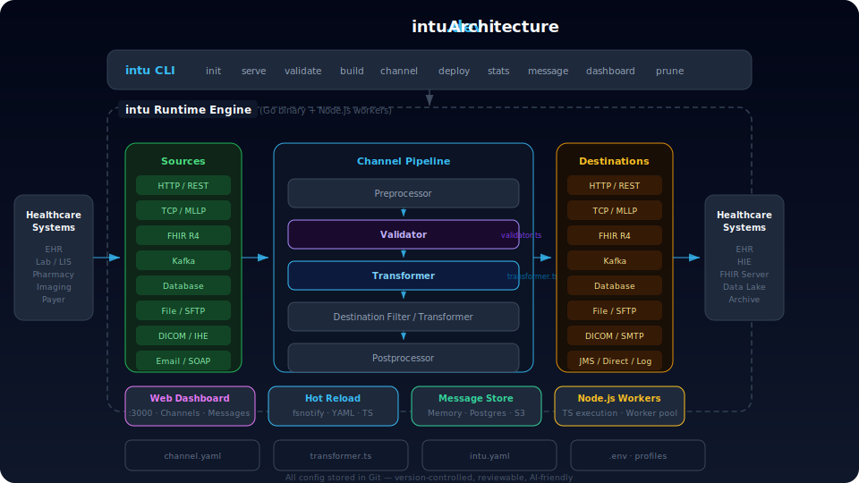
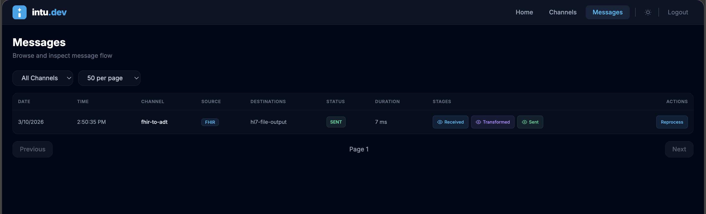

<p align="center">
  <a href="https://intu.dev">
    
  </a>
</p>

<h1 align="center">intu</h1>

<p align="center">
  <strong>Integration as Code for Healthcare</strong><br>
  Build, version, and deploy healthcare integration pipelines using YAML and TypeScript.
</p>

<p align="center">
  <a href="https://github.com/intuware/intu-dev/actions/workflows/ci.yml"></a>
  <a href="https://www.npmjs.com/package/intu-dev"></a>
  <a href="https://www.npmjs.com/package/intu-dev"></a>
  <a href="https://github.com/intuware/intu-dev/blob/main/LICENSE"></a>
  <a href="https://goreportcard.com/report/github.com/intuware/intu"></a>
</p>

<p align="center">
  <a href="https://intu.dev">Website</a> · <a href="https://intu.dev/documentation/index.html">Docs</a> · <a href="https://www.npmjs.com/package/intu-dev">npm</a> · <a href="https://github.com/intuware/intu-dev/issues">Issues</a>
</p>

---

`intu` is a Git-native, AI-friendly healthcare interoperability framework. Define channels as YAML config and TypeScript transformers, store everything in Git, and run a production-grade engine with a single command.

## Why intu?

- **Integration as Code** — Pipelines are YAML + TypeScript files in Git. No GUI, no database config, no vendor lock-in.
- **Healthcare-native** — HL7v2, FHIR R4, X12, CCDA, DICOM parsers and connectors built in.
- **Fast** — Go binary + Node.js worker pool. Sub-millisecond transforms. Hot-reload on file change.
- **AI-friendly** — Declarative config means LLMs can generate, modify, and review pipelines.
- **Full pipeline** — Preprocessor → Validator → Source Filter → Transformer → Destination Filter → Destination Transformer → Response Transformer → Postprocessor.
- **12 source connectors, 13 destination connectors** — HTTP, TCP/MLLP, FHIR, Kafka, Database, File, SFTP, Email, DICOM, SOAP, IHE, Channel, SMTP, JMS, Direct, Log.

## Install

**Via npm (recommended):**

```bash
npm i -g intu-dev
```

This installs the Go binary for your platform automatically.

**From source:**

```bash
go build -o intu .
```

## Quick Start

```bash
intu init my-project
cd my-project
npm run dev
```

`intu init` scaffolds the project and runs `npm install`. `npm run dev` starts the engine with auto-compile and hot-reload.

Add a channel:

```bash
intu c my-channel
```

## Dashboard

`intu` ships with a built-in web dashboard for monitoring channels, browsing messages, and triggering reprocessing.

<p align="center">
  
</p>

## Project Structure

```
.
├── intu.yaml              # Root config + named destinations
├── intu.dev.yaml          # Dev profile overlay
├── intu.prod.yaml         # Prod profile overlay
├── .env                   # Environment variables
├── channels/
│   └── sample-channel/
│       ├── channel.yaml   # Channel config (source, destinations, pipeline)
│       ├── transformer.ts # TypeScript transformer (JSON in, JSON out)
│       └── validator.ts   # Optional validator
├── lib/
│   └── index.ts           # Shared utilities
├── package.json
├── tsconfig.json
└── README.md
```

## CLI Reference

All commands accept `--log-level (debug|info|warn|error)` (default: `info`).

### Project & Build

| Command | Description |
|---------|-------------|
| `intu init <name> [--dir] [--force]` | Scaffold a new project and install dependencies |
| `intu serve [--dir] [--profile]` | Start the runtime engine (auto-compiles TypeScript) |
| `intu validate [--dir] [--profile]` | Validate project config and channel layout |
| `intu build [--dir]` | Compile TypeScript transformers |

### Channel Management

| Command | Description |
|---------|-------------|
| `intu c <name> [--dir] [--force]` | Add a new channel (shorthand) |
| `intu channel list [--dir] [--tag] [--group]` | List channels |
| `intu channel describe <id> [--dir]` | Show channel config |
| `intu channel clone <source> <new> [--dir]` | Clone a channel |
| `intu channel export <id> [--dir] [-o file]` | Export as `.tar.gz` |
| `intu channel import <archive> [--dir]` | Import from `.tar.gz` |

### Operations

| Command | Description |
|---------|-------------|
| `intu deploy [id] [--dir] [--all] [--tag]` | Enable channel(s) |
| `intu undeploy <id> [--dir]` | Disable a channel |
| `intu stats [id] [--dir] [--json]` | Show channel statistics |
| `intu prune [--dir] [--channel\|--all] [--before]` | Prune stored messages |
| `intu message list [--channel] [--status] [--limit]` | Browse messages |
| `intu message get <id> [--json]` | Get a specific message |
| `intu dashboard [--dir] [--port]` | Launch dashboard standalone |

## Sources & Destinations

### Sources

| Type | Description |
|------|-------------|
| HTTP | REST/JSON listener with auth and TLS |
| TCP/MLLP | Raw TCP or HL7 MLLP with ACK/NACK |
| FHIR | FHIR R4 server with capability statement |
| Kafka | Consumer with TLS and SASL |
| Database | SQL polling (Postgres, MySQL, MSSQL, SQLite) |
| File | Filesystem poller with glob patterns |
| SFTP | SFTP poller with key/password auth |
| Email | IMAP/POP3 reader |
| DICOM | DICOM SCP with AE title validation |
| SOAP | SOAP/WSDL listener |
| IHE | XDS, PIX, PDQ profiles |
| Channel | In-memory channel-to-channel bridge |

### Destinations

| Type | Description |
|------|-------------|
| HTTP | Sender with auth (bearer, basic, OAuth2) and TLS |
| Kafka | Producer with TLS and SASL |
| TCP/MLLP | TCP sender with MLLP support |
| File | Filesystem writer with templated filenames |
| Database | SQL writer with parameterized statements |
| SFTP | SFTP file writer |
| SMTP | Email sender with TLS/STARTTLS |
| Channel | In-memory routing |
| DICOM | DICOM SCU sender |
| JMS | JMS via HTTP REST (ActiveMQ, etc.) |
| FHIR | FHIR R4 client for create/update/transaction |
| Direct | Direct messaging protocol for HIE |
| Log | Structured logging destination |

### Data Types

`raw` · `json` · `xml` · `csv` · `hl7v2` · `hl7v3/ccda` · `fhir_r4` · `x12` · `binary`

## Destinations Config

Define named destinations in `intu.yaml`:

```yaml
destinations:
  kafka-output:
    type: kafka
    kafka:
      brokers: [${INTU_KAFKA_BROKER}]
      topic: output-topic
    retry:
      max_attempts: 3
      backoff: exponential
      initial_delay_ms: 500
```

Channels reference them by name (multi-destination supported):

```yaml
destinations:
  - kafka-output
  - name: audit-http
    type: http
    http:
      url: https://audit.example.com/events
```

## Contributing

Contributions are welcome — bug reports, docs, and code.

- **Issues & PRs**: [github.com/intuware/intu-dev](https://github.com/intuware/intu-dev)
- **Contact**: ramnish@intuware.com

## License

`intu` is licensed under the [Mozilla Public License 2.0 (MPL-2.0)](LICENSE).
